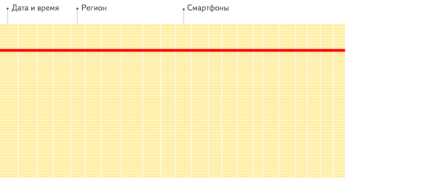
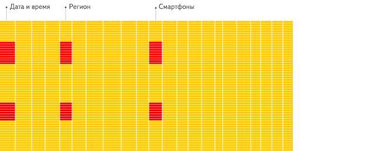

# ClickHouse

## 介绍

ClickHouse是一个用于**联机分析(OLAP)**的**列式数据库**管理系统(DBMS)。

### 列式数据库：来自不同列的值被单独存储，来自同一列的数据被存储在一起

在传统的行式数据库系统中，数据按如下顺序存储：

| Row  | WatchID     | JavaEnable | Title              | GoodEvent | EventTime           |
| ---- | ----------- | ---------- | ------------------ | --------- | ------------------- |
| #0   | 89354350662 | 1          | Investor Relations | 1         | 2016-05-18 05:19:20 |
| #1   | 90329509958 | 0          | Contact us         | 1         | 2016-05-18 08:10:20 |
| #2   | 89953706054 | 1          | Mission            | 1         | 2016-05-18 07:38:00 |
| #N   | …           | …          | …                  | …         | …                   |

**处于同一行中的数据总是被物理的存储在一起**。

常见的行式数据库系统有：`MySQL`、`Postgres`和`MS SQL Server`。

在列式数据库系统中，数据按如下的顺序存储：

| Row:        | #0                  | #1                  | #2                  | #N   |
| ----------- | ------------------- | ------------------- | ------------------- | ---- |
| WatchID:    | 89354350662         | 90329509958         | 89953706054         | …    |
| JavaEnable: | 1                   | 0                   | 1                   | …    |
| Title:      | Investor Relations  | Contact us          | Mission             | …    |
| GoodEvent:  | 1                   | 1                   | 1                   | …    |
| EventTime:  | 2016-05-18 05:19:20 | 2016-05-18 08:10:20 | 2016-05-18 07:38:00 | …    |

这些示例只显示了数据的排列顺序。**来自不同列的值被单独存储，来自同一列的数据被存储在一起。**

常见的列式数据库有： Vertica、 Paraccel (Actian Matrix，Amazon Redshift)、 Sybase IQ、 Exasol、 Infobright、 InfiniDB、 MonetDB (VectorWise， Actian Vector)、 LucidDB、 SAP HANA、 Google Dremel、 Google PowerDrill、 Druid、 kdb+。

### OLAP（理解为就是用来分析的）

OLAP场景的关键特征

- **绝大多数是读请求**
- 数据以相当大的批次(> 1000行)更新，而不是单行更新;或者根本没有更新。
- 已添加到数据库的数据不能修改。
- **对于读取，从数据库中提取相当多的行，但只提取列的一小部分。**
- **宽表，即每个表包含着大量的列**
- 查询相对较少(通常每台服务器每秒查询数百次或更少)
- 对于简单查询，允许延迟大约50毫秒
- 列中的数据相对较小：数字和短字符串(例如，每个URL 60个字节)
- 处理单个查询时需要高吞吐量(每台服务器每秒可达数十亿行)
- **事务不是必须的，比如在银行的一笔交易记录，就是一个典型的事务。**
- 对数据一致性要求低
- 每个查询有一个大表。除了他以外，其他的都很小。
- **查询结果明显小于源数据。换句话说，数据经过过滤或聚合，因此结果适合于单个服务器的RAM中**

### OLTP（理解为就是用来记录的）

联机事务处理OLTP（on-line transaction processing） 主要是执行基本日常的事务处理，比如数据库记录的增删查改。**比如在银行的一笔交易记录，就是一个典型的事务。**
OLTP的特点一般有：
1.实时性要求高。我记得之前上大学的时候，银行异地汇款，要隔天才能到账，而现在是分分钟到账的节奏，说明现在银行的实时处理能力大大增强。
2.数据量不是很大，生产库上的数据量一般不会太大，而且会及时做相应的数据处理与转移。
3.交易一般是确定的，比如银行存取款的金额肯定是确定的，所以OLTP是对确定性的数据进行存取
4.高并发，并且要求满足ACID原则。比如两人同时操作一个银行卡账户，比如大型的购物网站秒杀活动时上万的QPS请求。

### 列式数据库更适合OLAP场景：针对分析类查询，通常只需要读取表的一小部分列，在列式数据库中你可以只读取你需要的数据





**针对分析类查询，通常只需要读取表的一小部分列。在列式数据库中你可以只读取你需要的数据**。例如，如果只需要读取100列中的5列，这将帮助你最少减少20倍的I/O消耗。

## 表引擎

### MergeTree

Clickhouse 中最强大的表引擎当属 `MergeTree` （合并树）引擎及该系列（`*MergeTree`）中的其他引擎。

只有 MergeTree 系列里的表可支持副本：ReplicatedMergeTree。

### Distributed

**分布式引擎本身不存储数据**, 但可以在多个服务器上进行分布式查询。
读是自动并行的。读取时，远程服务器表的索引（如果有的话）会被使用。
分布式引擎参数：服务器配置文件中的集群名，远程数据库名，远程表名，数据分片键（可选）。
示例：

```
Distributed(logs, default, hits[, sharding_key])
```

将会从位于«logs»集群中 default.hits 表所有服务器上读取数据。
远程服务器不仅用于读取数据，还会对尽可能数据做部分处理。

## 接口

### 命令行客户端

```linux
clickhouse-cli --queuename "root.XXXX" \
-e "LOAD DATA OVERWRITE INTO dal.oa_mixsong_searchlocal_play_heat partition (dt='${DATA_DATE}') primary key (dt) 
FROM dal_search.oa_mixsong_searchlocal_play_heat partition (dt='${DATA_DATE}')"
```

### http客户端

HTTP接口允许您在任何编程语言的任何平台上使用ClickHouse。我们使用它在Java和Perl以及shell脚本中工作。

默认情况下，`clickhouse-server`会在`8123`端口上监控HTTP请求（这可以在配置中修改）。

```linux
$ curl 'http://localhost:8123/'
Ok.
```

## 基本语法

### 建立表

先创建本地表，再创建分布式表。

Distributed(cluster, datebase, local_table[, sharding_key])

- cluster需要写成在config里自定义的cluster名称
- database是分片数据库的名称
- local_table是分片本地表的名称
- 最后一项sharding_key是选填的，可以是一个表达式，例如rand()，也可以是某列 如user_id

将会从位于«cluster»集群中 datebase.local_table表所有服务器上读取数据。


```sql
CREATE TABLE realtime_local.kw_search_play_mixxxxxid_newsong_h on cluster xx_xx_cluster
(
    etldate Date,
    hour String,
    kw String,
    mixxxxxid String,
    overplay Int64,
    search_play Int64,
    search_play_30 Int64,
    click_cnt Int64,
    kw_click_cnt Int64,
    play_last Float64,
    click_cnt_all Int64,
    kw_click_cnt_all Int64,
    play_last_all Float64,
    play_last_xxxxxson Float64,
    play_last_all_xxxxxson Float64
)
ENGINE = ReplicatedMergeTree('/clickhouse/tables/realtime_local/kw_search_play_mixxxxxid_newsong_h/{shard}', '{replica}')
PARTITION BY etldate
ORDER BY (etldate, hour, kw)
SETTINGS index_granularity = 8192
```

```sql
CREATE TABLE realtime.kw_search_play_mixxxxxid_newsong_h on cluster xx_xx_cluster
(
etldate Date,
hour String,
kw String,
mixxxxxid String,
overplay Int64,
search_play Int64,
search_play_30 Int64,
click_cnt Int64,
kw_click_cnt Int64,
play_last Float64,
click_cnt_all Int64,
kw_click_cnt_all Int64,
play_last_all Float64,
play_last_xxxxxson Float64,
play_last_all_xxxxxson Float64
)ENGINE = Distributed('xx_xx_cluster', 'realtime_local', 'kw_search_play_mixxxxxid_newsong_h', cityHash64(kw))
```

```sql
--视图表
CREATE TABLE realtime.kw_search_play_mixxxxxid_newformula_h on cluster xx_xx_cluster
( 
etldate Date,
hour String,
kw String,
mixxxxxid String,
overplay Int64,
search_play Int64,
search_play_30 Int64,
click_cnt Int64,
kw_click_cnt Int64,
play_last Float64,
click_cnt_all Int64,
kw_click_cnt_all Int64,
play_last_all Float64,
play_last_xxxxxson Float64,
play_last_all_xxxxxson Float64,
play_last_new Float64,
play_last_all_new Float64,
play_last_xxxxxson_new Float64,
play_last_all_xxxxxson_new Float64,
search_play_full Int64,
upload_time String,
overplay_approx Int64,
search_play_approx Int64,
search_play_30_approx Int64,
click_cnt_approx Int64,
play_last_approx Float64,
click_cnt_all_approx Int64,
play_last_all_approx Float64,
play_last_xxxxxson_approx Float64,
play_last_all_xxxxxson_approx Float64,
play_last_new_approx Float64,
play_last_all_new_approx Float64,
play_last_xxxxxson_new_approx Float64,
play_last_all_xxxxxson_new_approx Float64,
search_play_full_approx Int64
) ENGINE = Distributed(xx_xx_cluster, 'realtime_local', 'kw_search_play_mixxxxxid_newformula_h', cityHash64(etldate));
```

```sql

--存储表
CREATE TABLE realtime_local.kw_search_play_mixxxxxid_newformula_h on cluster xx_xx_cluster 
(
etldate Date,
hour String,
kw String,
mixxxxxid String,
overplay Int64,
search_play Int64,
search_play_30 Int64,
click_cnt Int64,
kw_click_cnt Int64,
play_last Float64,
click_cnt_all Int64,
kw_click_cnt_all Int64,
play_last_all Float64,
play_last_xxxxxson Float64,
play_last_all_xxxxxson Float64,
play_last_new Float64,
play_last_all_new Float64,
play_last_xxxxxson_new Float64,
play_last_all_xxxxxson_new Float64,
search_play_full Int64,
upload_time String,
overplay_approx Int64,
search_play_approx Int64,
search_play_30_approx Int64,
click_cnt_approx Int64,
play_last_approx Float64,
click_cnt_all_approx Int64,
play_last_all_approx Float64,
play_last_xxxxxson_approx Float64,
play_last_all_xxxxxson_approx Float64,
play_last_new_approx Float64,
play_last_all_new_approx Float64,
play_last_xxxxxson_new_approx Float64,
play_last_all_xxxxxson_new_approx Float64,
search_play_full_approx Int64
) ENGINE = ReplicatedMergeTree('/clickhouse/tables/realtime_local/kw_search_play_mixxxxxid_newformula_h/{shard}', '{replica}',
etldate, etldate, 8192);
```

#### 优化建表

##### sharding key

分布式表，选择合适的有意义的列作为sharding key.没有的话，再选择`rand()`。[参考资料](https://stackoverflow.com/questions/66296329/what-is-the-best-way-to-chose-shard-key-in-clickhouse)

I am trying to understand how to choose the shard key in Clickhosue ? and how clickhosue chooses which shard? for example, i have a table with 3 columns : user_id, timestamp, city_id.

should i shard by user_id or by City?

i use murmurHash3_64 function.

murmurHash3_64(city_id = 1) return :

```
┌──murmurHash3_64(1)─┐
│ 956517343494314387 │
└────────────────────┘
```

First of all you need to understand why do you need sharding by some meaningful column. Why you could not use `rand()`?

Usually it's not a question what to use, because the sharding naturally follows the business requirements. If you don't have such requirements then you should use `rand()`.

CH uses modulo operation + weight . It's very simple. If you have 6 shards then 956517343494314387 % 6 = 5 === shard number 5. So the rows with the same city_id will be placed on the same shard.

So if you chose city_id as shard key and the distribution by the city usually unequal so the shading will be unequal too. All rows for the big cities like New York or Mexico will in the one shard.

So user_id looks more appropriate as sharding key.

##### 新旧建表语句

[创建复制表](https://clickhouse.com/docs/zh/engines/table-engines/mergetree-family/replication/#creating-replicated-tables)

在表引擎名称上加上 `Replicated` 前缀。例如：`ReplicatedMergeTree`。

**Replicated\*MergeTree 参数**

- `zoo_path` — ZooKeeper 中该表的路径。
- `replica_name` — ZooKeeper 中的该表的副本名称。

示例:

```
CREATE TABLE table_name
(
    EventDate DateTime,
    CounterID UInt32,
    UserID UInt32
) ENGINE = ReplicatedMergeTree('/clickhouse/tables/{layer}-{shard}/table_name', '{replica}')
PARTITION BY toYYYYMM(EventDate)
ORDER BY (CounterID, EventDate, intHash32(UserID))
SAMPLE BY intHash32(UserID)
```

已弃用的建表语法示例：

```
CREATE TABLE table_name
(
    EventDate DateTime,
    CounterID UInt32,
    UserID UInt32
) ENGINE = ReplicatedMergeTree('/clickhouse/tables/{layer}-{shard}/table_name', '{replica}', EventDate, intHash32(UserID), (CounterID, EventDate, intHash32(UserID), EventTime), 8192)
```

#### 分区(partition by)、索引(order by)、表参数(8192)

[参考资料](https://www.cnblogs.com/qiu-hua/p/15113528.html)

分区粒度根据业务特点决定，不宜过粗或过细。**<u>一般选择按天分区</u>**，也可以指定为 Tuple()，以单表一亿数据为例，分区大小控制在 10-30 个为最佳。[新数据插入到表中时，这些数据会存储为按主键排序的新片段（块）。插入后 10-15 分钟，同一分区的各个片段会合并为一整个片段。](https://clickhouse.com/docs/zh/engines/table-engines/mergetree-family/custom-partitioning-key/)

必须指定索引列，ClickHouse 中的**<u>索引列即排序列</u>**，通过 order by 指定，一般在查询条件中经常被用来充当筛选条件的属性被纳入进来；可以是单一维度，也可以是组合维度的索引；**通常需要满足高级列在前、查询频率大的在前原则；还有基数特别大的不适合做索引列，如用户表的 userid 字段**；通常**筛选后的数据满足在百万以内为最佳。**

Index_granularity 是用来控制索引粒度的，**<u>默认是 8192，如非必须不建议调整</u>**。

### 调试

使用`format TabSeparatedWithNames`导出列表名，否则不显示列表名，然后使用正则` +`替换成为`\t`，即可展示帮助调试。

```bash
echo "
select *  
from realtime.kw_search_play_mixxxxxid_newformula_hour_approx_h 
where etldate in ('2021-11-01') 
and hour='17' 
and mixxxxxid = 'xxxxxxx' and kw = 'xx' format TabSeparatedWithNames 
" | curl 'http://xx.x.xxx.xx:8123/?user=xx_xxxxx&password=xx_xxxxx' -d @- > "${dst_path}/${filename_txt}"
check_file_size "${dst_path}/${filename_txt}"
```

### 数据类型

#### 浮点数

NaN和Inf

与标准SQL相比，ClickHouse 支持以下类别的浮点数：

- `Inf` – 正无穷

```
SELECT 0.5 / 0
┌─divide(0.5, 0)─┐
│            inf │
└────────────────┘
```

- `-Inf` – 负无穷

```
SELECT -0.5 / 0
┌─divide(-0.5, 0)─┐
│            -inf │
└─────────────────┘
```

- `NaN` – 非数字

```
SELECT 0 / 0

┌─divide(0, 0)─┐
│          nan │
└──────────────┘
```

处理方法：

```sql
case when isNaN(play_last_new) then 0  when isInfinite(play_last_new) then 0 else play_last_new end as play_last_new, 
```


### 其他

```bash
logfile=$BIPROG_ROOT/logs/`basename $0`.log #定义写日志文件名

###############################引入公共函数库#########################
source $BIPROG_ROOT/bin/shell/common.sh

###定义内部变量##################
YYYYMMDD=`echo ${DATA_DATE}|cut -c1-8`
vHour=`echo ${DATA_DATE}|cut -c9-10`
vDay=`date -d "$YYYYMMDD" +"%Y-%m-%d"`
vMonthExpired=`date -d "$YYYYMMDD 40 days ago" +"%Y%m"`
vRealyHour=${vDay}" "${vHour}
v1Hourbefore=`date -d "-1 hour $vRealyHour" +"%Y-%m-%d %H"`
v3Hourbefore=`date -d "-3 hour $vRealyHour" +"%Y-%m-%d %H"`
v3Hourbefore180=`date -d "-180 days -3 hour $vRealyHour" +"%Y-%m-%d %H"`
v6Hourbefore=`date -d "-6 hour $vRealyHour" +"%Y-%m-%d %H"`
v24Hourbefore=`date -d "-24 hour $vRealyHour" +"%Y-%m-%d %H"`
[ -z "$vDay" ] && { echo "no vDay founded."; exit 1; }
vDayYYYYMMDD=`echo ${vDay}|tr -d '-'`
vDay8daysago=`date -d "$vDay +7 days ago" +%Y%m%d`
writelog "vDay8daysago=${vDay8daysago}"

mr_queue=root.tenx
############################ 功能执行部分 ############################
writelog "Program($VERSION) start..."
writelog ${vDay}
writelog ${v24Hourbefore}
writelog ${vRealyHour}

echo "save day is: $vDay"
echo "save hour is: $vHour"
echo "right now is: $vRealyHour"
echo "one hour before is: $v1Hourbefore"
echo "24 hours befor is $v24Hourbefore"

efficient=XXXXXXXXXXXXXXXXXXXXXXXX

echo "insert into realtime.kw_search_play_mixxxxxid_newsong_h"
echo "insert into realtime.kw_search_play_mixxxxxid_newsong_h
select 
    etldate
    , hour
    , kw
    , mixxxxxid
    , overplay*100/$efficient
    , search_play*100/$efficient
    , search_play_30*100/$efficient
    , click_cnt*100/$efficient
    , kw_click_cnt
    , round(play_last*100/$efficient, 6) as play_last
    , click_cnt_all*100/$efficient
    , kw_click_cnt_all
    , round(play_last_all*100/$efficient, 6) as play_last_all
    , round(play_last_xxxxxson*100/$efficient, 6) as play_last_xxxxxson
    , round(play_last_all_xxxxxson*100/$efficient, 6) as play_last_all_xxxxxson
from 
(
    select 
        etldate, hour, kw, mixxxxxid, overplay, search_play, search_play_30, click_cnt, kw_click_cnt, play_last, click_cnt_all
        , kw_click_cnt_all, play_last_all, play_last_xxxxxson, play_last_all_xxxxxson, b.upload_time 
    from 
    (
        select 
              '${vDay}' as etldate, '${vHour}' as hour, kw, mixxxxxid, overplay, search_play, search_play_30
             , click_cnt, kw_click_cnt, play_last, click_cnt_all, kw_click_cnt_all, play_last_all, play_last_xxxxxson, play_last_all_xxxxxson 
        from 
        (
            select 
                  kw, a.mixxxxxid, overplay, search_play, search_play_30, click_cnt, kw_click_cnt
                 , case when b.mixxxxxid<>'' then play_last*X else play_last end as play_last
                 , click_cnt_all, kw_click_cnt_all
                 , case when b.mixxxxxid<>'' then play_last_all*X else play_last_all end as play_last_all
                 , case when b.mixxxxxid<>'' then play_last_xxxxxson*X else play_last_xxxxxson end as play_last_xxxxxson
                 , case when b.mixxxxxid<>'' then play_last_all_xxxxxson*X else play_last_all_xxxxxson end as play_last_all_xxxxxson
            from 
            (
                select 
                      a.kw, a.mixxxxxid, a.overplay, a.search_play, a.search_play_30
                     , a.click_cnt, a.kw_click_cnt, a.play_last, play_last_xxxxxson
                     , a.click_cnt_all, b.kwplay as kw_click_cnt_all, a.play_last_all, play_last_all_xxxxxson
                from 
                (
                    select 
                          XXXXXXXXXXXXXXXXXXXXXXXX
                    from 
                    (
                        select 
                              a.kw, a.mixxxxxid, a.overplay, a.search_play, a.search_play_30
                             , a.click_cnt, a.kw_click_cnt, a.play_last, a.play_last_xxxxxson, b.search_play as click_cnt_all
                        from 
                        (
                            select 
                                  a.kw, a.mixxxxxid, a.overplay, a.search_play, a.search_play_30
                                 , a.click_cnt, b.kwplay as kw_click_cnt, a.play_last, a.play_last_xxxxxson
                            from 
                            (
                                select 
                                    XXXXXXXXXXXXXXXXXXXXXXXX
                                from 
                                (
                                    select 
                                          a.kw, a.mixxxxxid, a.overplay, a.search_play, a.search_play_30
                                         , b.search_play as click_cnt
                                    from    
                                    (
                                        select 
                                              kw, scid_albumid as mixxxxxid, sum(overplay) as overplay
                                             , sum(search_play) as search_play, sum(search_play_30) as search_play_30
                                        from realtime.kw_search_play_h
                                        where dt between subtractDays(toDate('${vDay}'),1) and '${vDay}'
                                            and concat(toString(dt),' ',hour) >='${v1Hourbefore}'  
                                            and concat(toString(dt),' ',hour) <'${vRealyHour}'
                                            and kw<>''
                                            and lower(kw) not like '%dj%'
                                            and kw not like '%原唱%'
                                            and kw not like '%免费%'
                                        group by kw, scid_albumid
                                    )a
                                    left join 
                                    (                   
                                        select kw, mixxxxxid, sum(search_play) as search_play
                                        from realtime.kw_search_click_h
                                        where dt between subtractDays(toDate('${vDay}'),1) and '${vDay}'
                                            and concat(toString(dt),' ',hour) >='${v1Hourbefore}'  
                                            and concat(toString(dt),' ',hour) <'${vRealyHour}'       
                                        group by kw, mixxxxxid
                                    )b using mixxxxxid, kw  
                                )a    
                                left join 
                                (
                                    select mixxxxxid
                                    from dal.mixxxxxid_timelength_30_d
                                    where etldate =subtractDays(toDate('${vDay}'),2)
                                )b using mixxxxxid        
                            )a
                            left join 
                            (
                                select kw, sum(search_play) as kwplay
                                from realtime.kw_search_click_h
                                where dt between subtractDays(toDate('${vDay}'),1) and '${vDay}'
                                    and concat(toString(dt),' ',hour) >='${v1Hourbefore}'  
                                    and concat(toString(dt),' ',hour) <'${vRealyHour}'
                                group by kw
                            )b using kw
                        )a
                        left join 
                        (                   
                            select kw, mixxxxxid, sum(search_play) as search_play
                            from realtime.kw_search_click_all_h
                            where dt between subtractDays(toDate('${vDay}'),1) and '${vDay}'
                                and concat(toString(dt),' ',hour) >='${v1Hourbefore}'  
                                and concat(toString(dt),' ',hour) <'${vRealyHour}'        
                            group by kw, mixxxxxid
                        )b using mixxxxxid, kw 
                    )a
                    left join 
                    (
                        select mixxxxxid
                        from dal.mixxxxxid_timelength_30_d
                        where etldate =subtractDays(toDate('${vDay}'),2)
                    )b using mixxxxxid        
                )a
                left join 
                (
                    select kw, sum(search_play)  as kwplay
                    from realtime.kw_search_click_all_h
                    where dt between subtractDays(toDate('${vDay}'),1) and '${vDay}'
                        and concat(toString(dt),' ',hour) >='${v1Hourbefore}'
                        and concat(toString(dt),' ',hour) <'${vRealyHour}'
                    group by kw
                )b using kw 
            )a 
            left join 
            (
                select mixxxxxid        
                from dal.dq_xxxxx_song
            )b using mixxxxxid
        )t where play_last<>0 or play_last_all<>0
    )a
    left join
    (
        select 
            mixxxxxid, max(upload_time) as upload_time 
        from (
            select mixxxxxid, upload_time 
            from dal.oa_mixsong_new_d 
            where is_publish='1' 
            and substring(upload_time, 1, 13)>='${v24Hourbefore}' 
            and substring(upload_time, 1, 13)<'${vRealyHour}' 
            group by mixxxxxid, upload_time  
        )a group by mixxxxxid 
    )b using mixxxxxid
)t where upload_time<>''
" | POST 'http://xx.x.xxx.xx:8123/?user=huge_insert&password=huge_insert@xxxxx' | tee /tmp/xx_tmp_$$.log
[ -s /tmp/xx_tmp_$$.log ] && { rm -f /tmp/xx_tmp_$$.log; exit 1; }
rm -f /tmp/xx_tmp_$$.log
echo sleep 180
sleep 180

echo "insert into realtime.kw_search_play_mixxxxxid_combinesong_h"
echo "insert into realtime.kw_search_play_mixxxxxid_combinesong_h
select 
    etldate
    , hour
    , kw
    , mixxxxxid
    , overplay
    , search_play
    , search_play_30
    , click_cnt
    , kw_click_cnt
    , play_last
    , click_cnt_all
    , kw_click_cnt_all
    , play_last_all
    , play_last_xxxxxson
    , play_last_all_xxxxxson 
from 
(
    select 
        etldate
        , hour
        , kw
        , mixxxxxid
        , overplay
        , search_play
        , search_play_30
        , click_cnt
        , kw_click_cnt
        , play_last
        , click_cnt_all
        , kw_click_cnt_all
        , play_last_all
        , play_last_xxxxxson
        , play_last_all_xxxxxson
        , b.upload_time 
    from 
    (
        select 
              '${vDay}' as etldate, '${vHour}' as hour, kw, mixxxxxid, overplay, search_play, search_play_30
             , click_cnt, kw_click_cnt, play_last, click_cnt_all, kw_click_cnt_all, play_last_all, play_last_xxxxxson, play_last_all_xxxxxson 
        from 
        (
            select 
                  kw, a.mixxxxxid, overplay, search_play, search_play_30, click_cnt, kw_click_cnt
                 , case when b.mixxxxxid<>'' then play_last*X else play_last end as play_last
                 , click_cnt_all, kw_click_cnt_all
                 , case when b.mixxxxxid<>'' then play_last_all*X else play_last_all end as play_last_all
                 , case when b.mixxxxxid<>'' then play_last_xxxxxson*X else play_last_xxxxxson end as play_last_xxxxxson
                 , case when b.mixxxxxid<>'' then play_last_all_xxxxxson*X else play_last_all_xxxxxson end as play_last_all_xxxxxson 
            from 
            (
                select 
                      a.kw, a.mixxxxxid, a.overplay, a.search_play, a.search_play_30
                     , a.click_cnt, a.kw_click_cnt, a.play_last, play_last_xxxxxson
                     , a.click_cnt_all, b.kwplay as kw_click_cnt_all, a.play_last_all, play_last_all_xxxxxson
                from 
                (
                    select 
                          XXXXXXXXXXXXXXXXXXXXXXXX
                    from 
                    (
                        select 
                              a.kw, a.mixxxxxid, a.overplay, a.search_play, a.search_play_30
                             , a.click_cnt, a.click_cnt_all, b.kwplay as kw_click_cnt, a.play_last, a.play_last_xxxxxson
                        from 
                        (
                            select 
                                XXXXXXXXXXXXXXXXXXXXXXXX
                            from 
                            (
                                select kw, mixxxxxid, avg(overplay) as overplay, avg(search_play) as search_play, avg(search_play_30) as search_play_30, avg(click_cnt) as click_cnt, avg(click_cnt_all) as click_cnt_all 
                                from (
                                    select etldate, hour, kw, mixxxxxid, overplay, search_play, search_play_30, click_cnt, click_cnt_all 
                                    from realtime.kw_search_play_mixxxxxid_newsong_h 
                                    where concat(toString(etldate),' ',hour) >='${v24Hourbefore}' 
                                    and concat(toString(etldate),' ',hour) <'${vRealyHour}' 
                                )a group by kw, mixxxxxid
                            )a    
                            left join 
                            (
                                select mixxxxxid
                                from dal.mixxxxxid_timelength_30_d
                                where etldate =subtractDays(toDate('${vDay}'),2)
                            )b using mixxxxxid        
                        )a
                        left join 
                        (
                            select kw, sum(search_play) as kwplay
                            from realtime.kw_search_click_h
                            where dt between subtractDays(toDate('${vDay}'),1) and '${vDay}'
                                and concat(toString(dt),' ',hour) >='${v24Hourbefore}'  
                                and concat(toString(dt),' ',hour) <'${vRealyHour}'
                            group by kw
                        )b using kw
                    )a
                    left join 
                    (
                        select mixxxxxid
                        from dal.mixxxxxid_timelength_30_d
                        where etldate =subtractDays(toDate('${vDay}'),2)
                    )b using mixxxxxid        
                )a
                left join 
                (
                    select kw, sum(search_play)  as kwplay
                    from realtime.kw_search_click_all_h
                    where dt between subtractDays(toDate('${vDay}'),1) and '${vDay}'
                        and concat(toString(dt),' ',hour) >='${v24Hourbefore}'
                        and concat(toString(dt),' ',hour) <'${vRealyHour}'
                    group by kw
                )b using kw 
            )a 
            left join 
            (
                select mixxxxxid        
                from dal.dq_xxxxx_song
            )b using mixxxxxid
        )t where play_last<>0 or play_last_all<>0
    )a
    left join
    (
        select 
            mixxxxxid, max(upload_time) as upload_time 
        from (
            select mixxxxxid, upload_time 
            from dal.oa_mixsong_new_d 
            where is_publish='1' 
            and substring(upload_time, 1, 13)>='${v24Hourbefore}' 
            and substring(upload_time, 1, 13)<'${vRealyHour}' 
            group by mixxxxxid, upload_time  
        )a group by mixxxxxid 
    )b using mixxxxxid
)t where upload_time<>''
" | POST 'http://xx.x.xxx.xx:8123/?user=huge_insert&password=huge_insert@xxxxx' | tee /tmp/xx_tmp_$$.log
[ -s /tmp/xx_tmp_$$.log ] && { rm -f /tmp/xx_tmp_$$.log; exit 1; }
rm -f /tmp/xx_tmp_$$.log
echo sleep 180
sleep 180

# # 清理
# if [ `echo ${DATA_DATE}|cut -c7-8` -eq 15 ]
# then
# echo "alter table realtime_local.kw_search_play_mixxxxxid_newsong_h ON CLUSTER xx_xx_cluster drop partition ${vMonthExpired}" | POST 'http://xx.x.xxx.xx:8123/?user=insert&password=insert@xxxxx' | tee /tmp/xx_tmp_$$.log
# rc=`grep -c "DB::Exception" /tmp/xx_tmp_$$.log`
# rm -f /tmp/xx_tmp_$$.log

# if [ `echo ${DATA_DATE}|cut -c7-8` -eq 15 ]
# then
# echo "alter table realtime_local.kw_search_play_mixxxxxid_combinesong_h ON CLUSTER xx_xx_cluster drop partition ${vMonthExpired}" | POST 'http://xx.x.xxx.xx:8123/?user=insert&password=insert@xxxxx' | tee /tmp/xx_tmp_$$.log
# rc=`grep -c "DB::Exception" /tmp/xx_tmp_$$.log`
# rm -f /tmp/xx_tmp_$$.log


writelog "Program finish successfully."
```

## 注意点（应该是echo和curl中才需要，因为格式影响代码执行）

### 条件=号要贴着两边

### 换行空格要预留

经常遇到from前面没有空格，从而报错

### curl的话要用global。。。

### and要换行

### **group by 使用内存限制**

默认情况下，ClickHouse会限制group by使用的内存量，默认设置为9.31GB，由users.xml文件中max_memory_usage参数控制，可以分别为每个用户设置不同的内存量。

在运行任务前增加配置，当然前提是你有足够的内存。增加这个参数：

```sql
SET max_memory_usage = 128000000000; #128G，
```

如果你没有那么多的内存可用，ClickHouse可以通过设置这个“溢出”数据到磁盘：

```sql
set max_bytes_before_external_group_by=20000000000; #20G
set max_memory_usage=40000000000; #40G
```

根据文档，如果需要使用max_bytes_before_external_group_by，建议将max_memory_usage设置为max_bytes_before_external_group_by大小的两倍。
（原因是聚合需要分两个阶段进行：1.查询并且建立中间数据 2.合并中间数据。 数据“溢出”到磁盘一般发生在第一个阶段，如果没有发生数据“溢出”，ClickHouse在阶段1和阶段2可能需要相同数量的内存）。

如果发现还是报内存不够或者服务器直接崩溃，报错如下：

```sql
:) SET max_memory_usage = 90000000000
Ok.
:) SET max_bytes_before_external_group_by = 30000000000
Ok.
:) select user_id,tool_id,sum(amount) from big_sgz_2017.bi_tool_list_all where dateline between '2021-03-23' and '2021-03-28' and amount > 0 and bi_pid in ('19','222','463','464','502','549','1015') group by user_id,tool_id

↘ Progress: 273.08 million rows, 15.29 GB (1.66 million rows/s., 93.05 MB/s.) ███████████████████████████████████████████████████████████████████████████████▋                             73%
Exception on client:
Code: 32. DB::Exception: Attempt to read after eof: while receiving packet from localhost:9000

Connecting to database prod at localhost:9000 as user default.
Code: 210. DB::NetException: Connection refused (localhost:9000)
```

设置partial_merge_join = 1，但是运行速度会很慢。

### read timeout at /usr/share/perl5/vendor_perl/Net/HTTP/Methods.pm

connect_timeout, receive_timeout, send_timeout[¶](https://clickhouse.com/docs/en/operations/settings/settings/#connect-timeout-receive-timeout-send-timeout)

Timeouts in seconds on the socket used for communicating with the client.

Default value: 10, 300, 300.

采用receive_timeout=600，提高socket时间。