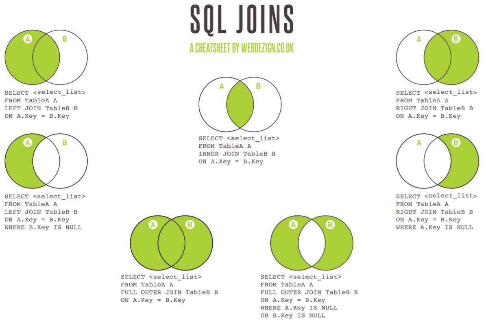

#Hive中join操作

##原理如下图


##注意事项
###1.其中left/right outer join是left/right join的另一种写法

###2.从join中select哪一个表的keywords字段的问题，如果自己写程序会发现其实inner join返回两个名字都叫keywords。但是实际上暗含"."，因此select中必须加入'.'，所以若两者完全相等，其实选哪个都一样。

###3.join在指定on时就是innerjoin；不指定on时就是隐式的crossjoin笛卡尔积（a表的一行和b表中每一行都组成一行，然后逐个下去）；使用cross join则显式指定笛卡尔连接。

###4.技巧使用left/right join来避免笛卡尔积。
```
right join的逻辑是基于on条件，只有在b表的key值在a表中存在，才会链接起来。
比如下两表中，right join会连接起两条记录，因为key值都相等。
a: 1, 2017-12-07;
   1, 2017-12-08;
b: 1, 2017-12-07, 100;
此时，我们可以考虑在返回的两条记录中（a.label, a.dt, b.label, b.dt, b.cnt）,只认定在a.dt = b.dt 时才返回cnt，其他都置0，从而达到笛卡尔积的目的。

select query, a.dt, (case when a.dt=b.dt then cnt else 0 end) as count from date_table a RIGHT OUTER JOIN keyword_30_sum b on a.label=b.label
```

###5.join中的表若有where条件，就放在on里面。
```hive
hive -e"
set mapreduce.job.queuename=root.baseDepSarchQueue;
INSERT INTO TABLE temp.jsearch_keyword_d PARTITION (dt='2017-07-20',song='renzhendexue') select time,timestamp,imei,version,channel,networktype,inputstring,inputtype,is_valid,reason,pagecount,listencount,addcount,downcount,playmvcount,collectcount,sharecount,filename,filenameindex,msec,localresult,isextend,localfilename,localindex,localreason,hint_type,click_no,correc_type,hint_key,correc_id,netresult,ivar1,ivar2 
from ddl.dt_search_ios_d as a
join (select distinct(imei) as mei from ddl.dt_search_ios_d where dt='2017-07-20' and inputstring='认真的雪' and is_valid=0 and inputtype in ('1','2','4'))b 
on (a.imei = b.mei and a.dt='2017-07-20')
;"
```

###6.LEFT SEMI JOIN 是 IN/EXISTS 子查询的一种更高效的实现。
LEFT SEMI JOIN 的限制是， JOIN 子句中右边的表只能在ON 子句中设置过滤条件，在 WHERE 子句、SELECT 子句或其他地方过滤都不行。
**注意LEFT SEMI JOIN只是为了限制而已，无法提取LEFT SEMI JOIN中的字段，因此若要提取只能用INNER JOIN搭配上ON的形式。**
```hive
SELECT a.key, a.value  
FROM a  
WHERE a.key in  
 (SELECT b.key  
  FROM B);  
```
可以被重写为，注意此时都需要改成a.变量的名字
```hive
SELECT a.key, a.val  
   FROM a LEFT SEMI JOIN b on (a.key = b.key)  
```

##常用代码
```hive
SELECT <select_list>
FROM TableA A
INNER JOIN TableB B
ON A.Key = B.Key

SELECT <select_list>
FROM TableA A
LEFT JOIN TableB B
ON A.Key = B.Key

SELECT <select_list>
FROM TableA A
LEFT JOIN TableB B
ON A.Key = B.Key
WHERE B.Key IS NULL

SELECT <select_list>
FROM TableA A
RIGHT JOIN TableB B
ON A.Key = B.Key

SELECT <select_list>
FROM TableA A
RIGHT JOIN TableB B
ON A.Key = B.Key
WHERE A.Key IS NULL

SELECT <select_list>
FROM TableA A
FULL OUTER JOIN TableB B
ON A.Key = B.Key

SELECT <select_list>
FROM TableA A
FULL OUTER JOIN TableB B
ON A.Key = B.Key
WHERE A.Key IS NULL
OR B.Key IS NULL

```

##References
[join原理](https://www.webdezign.co.uk/wp-content/uploads/2015/01/SQL-joins.pdf)
